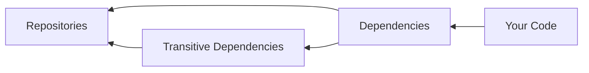
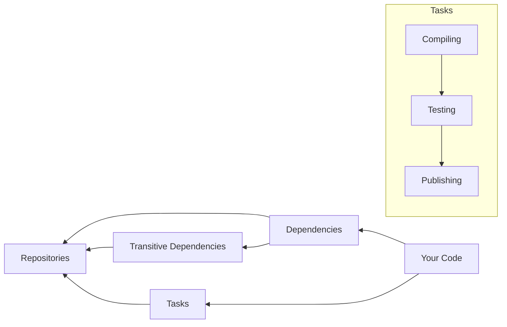

# Introduction to Gradle for Developers

# [←](../../../README.md)

## Core Concepts
- Build Configuration
- Plugins & tasks
- Dependency Management

## Dependency Management

The code you right should be 
- Compiled
- Tested
- published

## Gradle Build Tool Core Concepts

* Build Configuration
* Tasks
* Dependency Management
* Build Lifecycle

### Concepts

- it's an open-source build automation tool
- Automate tasks:
  - compiling
  - testing
  - publishing
- Comprehensive and flexible dependency management
  - Consistent and reproducible builds

#  [←](../../../README.md)