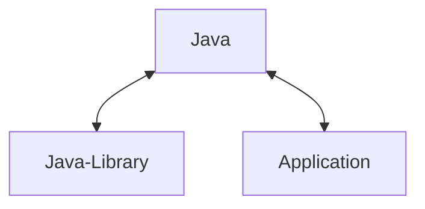

# Plugins

* Reusable common functionality
* Plugins can be applied to Gradle configurations
* Extend Gradle capabilities
  * Add new configuration model
  * Initialize configuration
  * Add tasks

## Plugin Types
### 1. Core
   - Shipped with Gradle distribution
   - [Core_Plugin_Reference](https://docs.gradle.org/current/userguide/plugin_reference.html#header)
   - You need not specify the version
#### Example

##### Java Plugins

There are 3 plugins
1. Base Java
    - `java` plugin
      - Build configuration for source code locations: *SourceSet*
        - `src/main/java`
        - `src/test/java`
      - Tasks like `compileJava` and `test`
2. Java Library Plugin
   - `java-library` plugin
     - also applies `java` plugin
     - you need not explicitly apply the base `java` plugin
     - Adds 'api' dependency configuration
3. Application Plugin
   - `application` plugin
   - Also applies `java` plugin
   - Build configuration for `main` class
   - Tasks to run or package an executable application

### 2. Community
   - Download from plugin repository
   - Need to specify version
### 3. Local
   - Implemented Locally