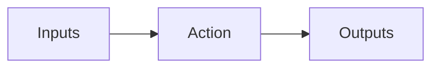

# Tasks

- Tasks are basic unit of work in Gradle
  - Compile
  - Test
  - Generate docs
- Tasks belong to project
  - Different projects can have different tasks

## List the task available

```bash
./gradlew tasks --all
```

## Command line options
- `--console=plain` or `--console=verbose`
  - will show dependent tasks executed
- `-q`
  - Hide log messages, so that only the output of the tasks is shown
- --dry-run
  - Show what will happen without executing

## Tasks concepts in Gradle


- Inputs read by task
  - Files
  - Configuration properties
  - Can be outputs from another tasks
- Action
  - what the task does when executing
- Outputs
  - eg. Files produced by action
  - Often outputs are put in the `build` directory
- Dependency & ordering
  - Other tasks that need to run before
  - Tasks that need to run after